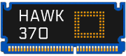
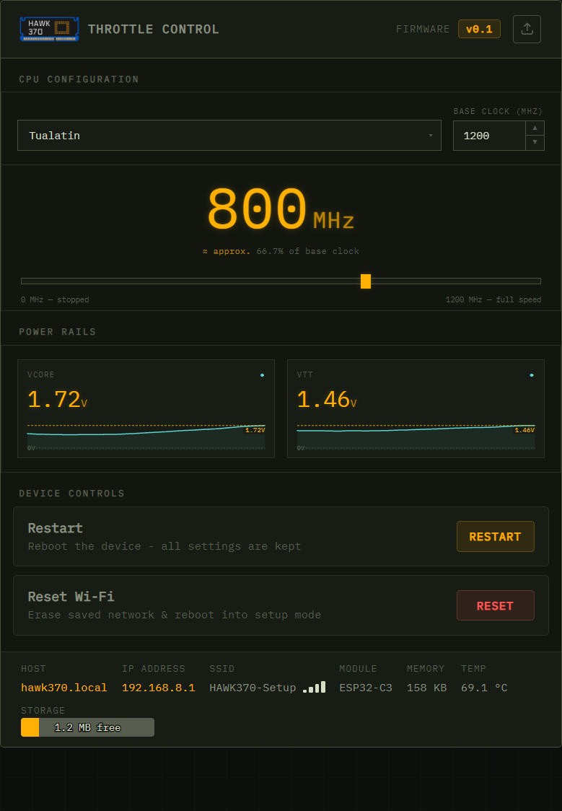
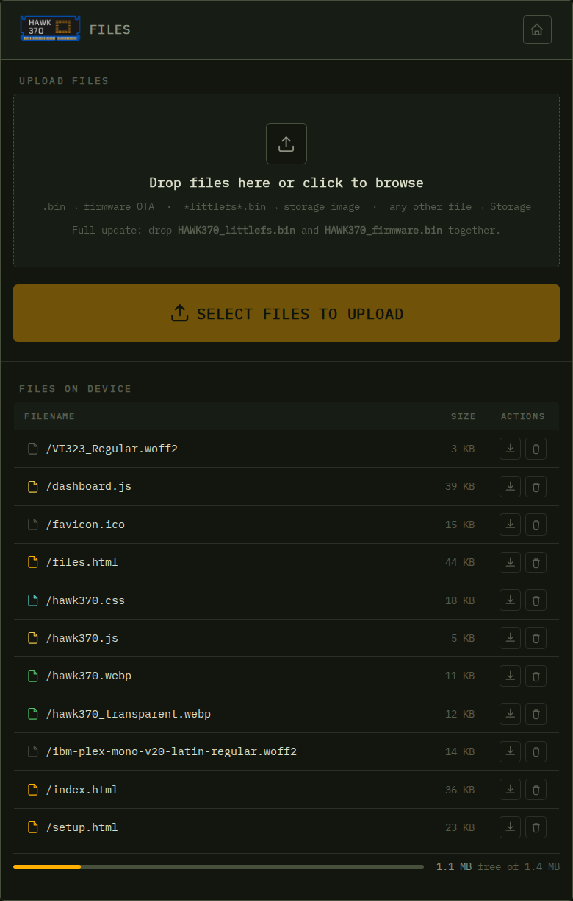
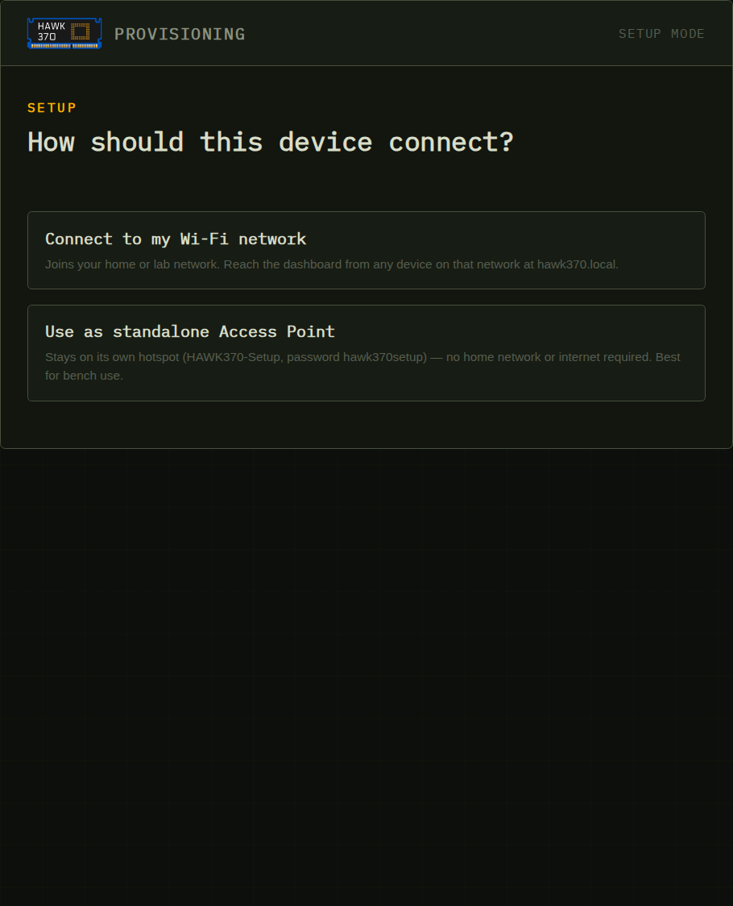

   

<h1 align="center">HAWK 370 · Wireless ThrottleBlaster</h1>

  A Wi‑Fi controlled Socket 370 CPU throttle for retro PC builders, running on an ESP32‑C3 SuperMini.

  
  
  

---

## What is this?

**HAWK 370** turns an ESP32‑C3 SuperMini into a wireless throttle controller for Socket 370 CPUs (Intel Mendocino / Coppermine / Tualatin, and VIA Samuel / Ezra / Nehemiah). It drives the CPU's `STPCLK#` pin with a hardware‑timed pulse‑density signal generated on the ESP32's RMT peripheral, and exposes a full web dashboard for control and monitoring - no companion app, no cloud, everything served straight from the module over your local network.

> ⚠️ **Pre‑bring‑up firmware.** STPCLK# timing follows Intel's own PIIX4 chipset throttle (32 µs shortest phase, 244 µs period) but has not been verified on a scope for every CPU family yet - see the note in the dashboard and `hawk_pattern.h`.

## Features

- **Two Wi‑Fi modes, one setup wizard** - join your home/lab network (STA), or run entirely standalone as its own access point (`HAWK370-Setup`) for bench use with no router required.
- **Live throttle control** - drag the slider, use the 25 / 50 / 75 / 100 % presets, or click the MHz readout to type an exact value (Enter or a click outside applies it, Esc cancels). Keyboard: ← / → ±1 MHz, Shift ±10 MHz, 1–4 for the presets. The browser tab shows the live speed. The readout shows the speed the CPU actually gets. Resolution is about 0.03% from ~0.1% to ~99.9% of the base clock.
- **Your own presets** - save speeds like "386DX-40 = 25 MHz" per CPU family (100 slots shared by all families) in a searchable A-Z dropdown. A preset stores the effective MHz, so one measured on a Tualatin 1400 gives the same speed on a Tualatin 1133 (the firmware just recomputes the duty). Rename, edit, delete, and export/import everything as one JSON file to share with others (import merges by name).
- **Pause at 0 MHz** - holds STPCLK# asserted; the CPU resumes exactly where it stopped when you move the slider. Power‑on is always full speed, so the PC always POSTs.
- **Intel‑referenced timing** - in the middle of the range the STPCLK# pattern uses the same 244 µs period as the 440BX chipset's own throttle, with continuous duty; outside it the short phase stays at 32 µs and the period stretches. Speed changes are glitch‑free: no STPCLK# phase is ever shorter than 32 µs.
- **Real‑time voltage & temperature telemetry** - VCORE and VTT rails streamed over Server‑Sent Events with live sparkline graphs, extensible to temperature monitoring.
- **OTA firmware & file manager** - drag‑and‑drop uploads. `.bin` files are flashed as firmware, `*littlefs*.bin` images replace the whole web storage, everything else is written to LittleFS (atomically, via a temporary file). Failed flashes are reported and do not reboot. Includes rename, delete, download, and a live storage‑usage bar.
- **Robust Wi‑Fi** - joining your network never blocks boot. If it is not reachable, the `HAWK370-Setup` access point comes up with the dashboard while the station keeps retrying in the background.
- **Wi‑Fi power‑saving toggle** - switch between low‑latency (`Max`) and power‑saving (`Eco`) modem modes on the fly.

## Screenshots

| Throttle Control | Files / OTA | Setup |
|---|---|---|
|  |  |  |

## Hardware

Built for an **ESP32‑C3 SuperMini** driving the HAWK 370 board.

| Signal | Pin | Notes |
|---|---|---|
| `STPCLK#` drive | GPIO 7 | Via onboard 2N7002, RMT TX output |
| VCORE sense | GPIO 0 (ADC1_CH0) | 10k/10k divider + 100nF |
| VTT sense | GPIO 1 (ADC1_CH1) | 10k/10k divider + 100nF |

The 2N7002 gate has a 10k pull‑down to VSS, so STPCLK# stays released while the ESP32 is in reset, flashing over USB, or not fitted. The STPCLK# waveform is looped entirely in RMT hardware, so Wi‑Fi activity can't introduce jitter into the timing.

On dual‑CPU boards only one HAWK 370 needs an ESP32: the 440BX chipset has a single STPCLK# output, so the boards very likely share one STPCLK# net between both slots (check continuity between the two slots' STPCLK# pins).

## Getting started

1. Open `ESP32_C3_SuperMini.ino` in the Arduino IDE (ESP32 core 3.x, tested with 3.3.12), board **ESP32C3 Dev Module**, *USB CDC On Boot: Enabled*. The `partitions.csv` in the sketch folder is picked up automatically (same layout as the core's default). Required libraries:
   - `ESPAsyncWebServer` and `AsyncTCP` (ESP32Async)
   - `ArduinoJson` 7
   - `ESPmDNS`, `DNSServer`, `LittleFS`, `Preferences` (bundled with the core)
2. Upload the contents of `data/` to LittleFS - or, once the firmware runs, drop the LittleFS image from `Build_Release.bat` onto the Files page.
3. Power up the board. On first boot it starts its own hotspot, **`HAWK370-Setup`** (password `hawk370setup`) - connect to it and open `http://hawk370.local` (or `192.168.8.1`) to run the setup wizard.
4. Choose to join your Wi‑Fi network, or stay in standalone Access Point mode for bench use.
5. Once connected, reach the dashboard at `http://hawk370.local` from any device on that network.

## Web UI overview

| Page | Purpose |
|---|---|
| `setup.html` | First‑boot wizard: choose AP vs. STA, scan and join a network |
| `index.html` | Main dashboard: CPU family/base clock config, throttle slider, VCORE/VTT graphs, device controls |
| `files.html` | Drag‑and‑drop uploader for firmware OTA and general file storage on LittleFS |

## Selected API endpoints

| Endpoint | Method | Description |
|---|---|---|
| `/api/throttle` | GET | Family, base clock, requested %, delivered % and MHz, paused |
| `/api/throttle/config` | POST | Set CPU family + base clock: `{"family":2,"baseMhz":1400}` |
| `/api/throttle/speed` | POST | Set speed: `{"speedPercent":25}` (0 = Pause, 100 = full speed) |
| `/api/presets?family=2` | GET | Presets of one CPU family, A-Z |
| `/api/presets/save` | POST | Create or edit: `{"family":2,"name":"386DX-40","mhz":25,"refBaseMhz":1400,"originalName":"…"}` |
| `/api/presets/delete` | POST | `{"family":2,"name":"386DX-40"}` |
| `/api/presets/import` | POST | Merge `{"family":2,"presets":[…]}` (the dashboard splits export files by family) |
| `/api/telemetry` | GET | One‑shot voltage/temp/RSSI/memory snapshot |
| `/events` | SSE | `telemetry` every ~500 ms, `throttle` on every change (keeps several browsers in sync) |
| `/api/system` | GET | Firmware version, IP, SSID, storage usage |
| `/api/ping` | GET | Liveness probe with boot id and setup-mode flag (CORS open; used to find the device after a restart or Wi‑Fi reset) |
| `/api/system/wifi-ps` | POST | Toggle Wi‑Fi power saving |
| `/api/files/all` | GET | List files on LittleFS |
| `/api/files/rename` / `/api/files/delete` | POST | Manage stored files |
| `/ota/firmware` | POST | Flash firmware; with `?target=fs` a LittleFS image |
| `/ota/file` | POST | Upload a file to storage |
| `/api/restart` / `/api/factory-reset` | POST | Restart device / erase Wi‑Fi credentials |

## Firmware layout

| File | Purpose |
|---|---|
| `ESP32_C3_SuperMini.ino` | `setup()` / `loop()` only |
| `hawk_config.h` | Pins, STPCLK# polarity, network identity |
| `hawk_pattern.*` | STPCLK# timing maths - pure C++, tested on a PC |
| `hawk_throttle.*` | RMT output, glitch‑free switching, Pause, CPU families |
| `hawk_presets.*` | User presets per CPU family, one compact record in NVS |
| `hawk_rails.*` | VCORE / VTT monitoring |
| `hawk_net.*` | Wi‑Fi modes, setup wizard, background reconnect |
| `hawk_web.*` | REST API, SSE, OTA, file manager |

Web handlers only post requests; every pin, RMT, radio and NVS change happens in `loop()`.

Run the tests on a PC with `sh test/run_tests.sh` (needs g++ or clang++). The modulator test sweeps every speed and base clock and checks that no phase is shorter than the minimum and the delivered speed matches the request. The preset test (needs ArduinoJson, found automatically or via `ARDUINOJSON_SRC`) covers saving, renaming, merging imports, the 100-slot limit, rolling back failed writes and moving v0.4 presets out of LittleFS.

Presets are stored in NVS, the ESP32's settings partition, not in LittleFS. Firmware updates, storage-image flashes and a Wi‑Fi reset all keep them. Only erasing the whole chip removes them (e.g. *Erase All Flash Before Sketch Upload* in the Arduino IDE), so export them before doing that.

## Acknowledgements

Web server, Wi‑Fi provisioning, mDNS, and OTA subsystems are adapted from my earlier [**AirMeter**](https://github.com/BitsUndBolts/airmeter) project.

ScrapComputing [**ThrottleBlaster**](https://github.com/scrapcomputing/ThrottleBlaster) Project

RetroLoom [**PWM2STPCLK**](https://github.com/RetroLoom/PWM2STPCLK) Project

## License

MIT © 2026
